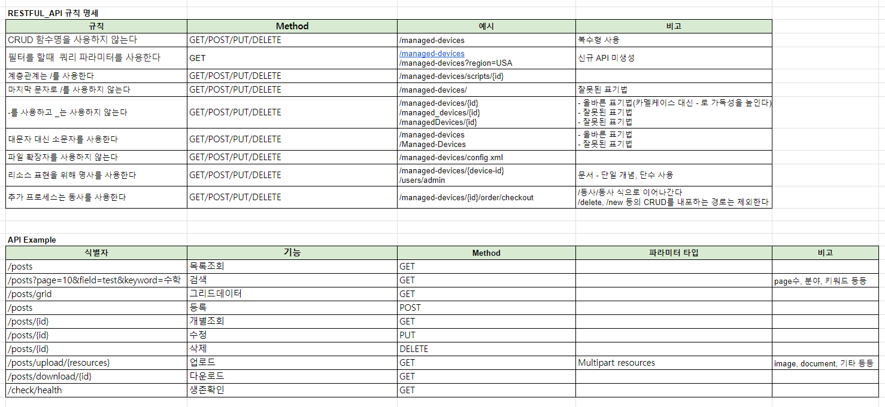

# Rest API URI Design

---

## REST API 원칙은 무엇이 다른가?

---
REST는 Http Method를 사용해서 클라이언트와 서버가 데이터 통신하는 방식에 대한 아키텍처 스타일이다.
기존에는 CRUD를 URL을 통해서 기능 명시를 하였는데, REST는 이에 반대한다는 점이 흥미로웠다. 
CRUD를 URL 대신 Http Method를 달리해서 구분하자는 내용이 포인트다.

프로젝트에 도움이 되고자 아래처럼 엑셀로 정리해 보았다.

## 

## Reference

---
https://prohannah.tistory.com/156