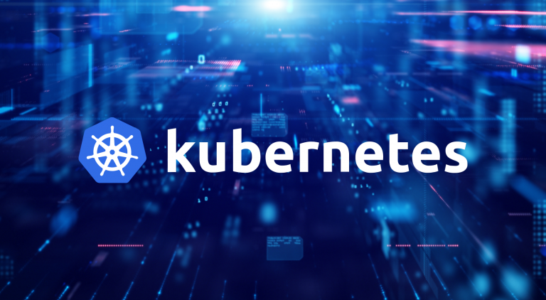
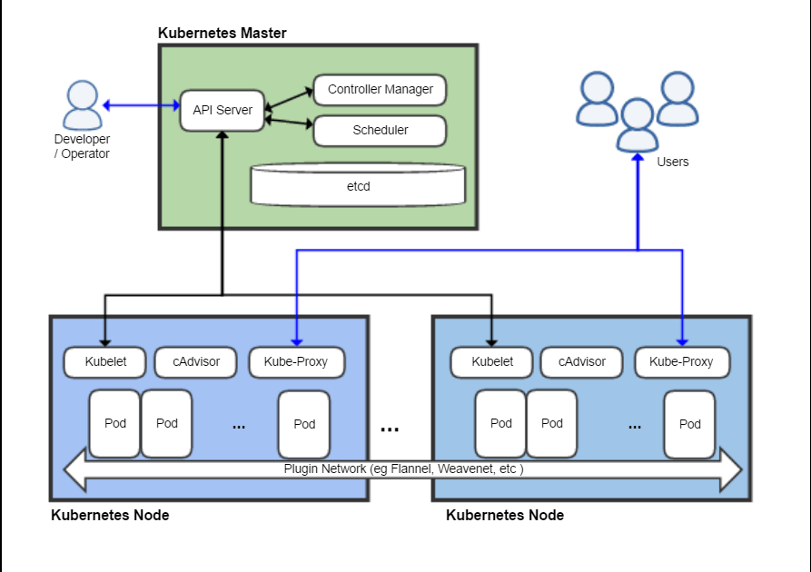

# 쿠버네티스란?

---

컨테이너를 사용하려면 컨테이너를 조작하는 도구가 필요한데, 이를 컨테이너 런타임이라고 한다.
컨테이너 런타임을 통해 컨테이너를 오케스트레이션하는 도구이다.

<쿠버네티스 구조>

# 장점 

---
* 애플리케이션 개발을 최적화 하는 경우 물리 또는 가상 머신의 클러스터에서 컨테이너를 예약하고 실행할 수 있는 플랫폼이 확보된다. 
* 프로덕션 환경에서 컨테이너 기반 인프라를 완전히 구현해서 사용할 수 있다. 
* 유연한 스케줄링, 서버 증설과 스케일 아웃이 가능하다.

# 사용 프로그램

---
### Helm - 쿠버네티스의 패키지 관리를 돕는다. 
사용 이유
* 애플리케이션들을 배포할 때마다 비슷한 틀, 내용을 가진 yaml 파일들을 각각 만들어주는 것이 번거롭기 때문이다. 

helm-chart란?
* 쿠버네티스 리소스를 하나로 묶은 패키지로, yaml 형식으로 구성되어 있다. 

### Argocd - 쿠버네티스 애플리케이션의 자동 배포를 위한 오픈소스 도구이다. (GitOps 방식 사용)
GitOps는 Git 저장소를 사용하는 소프트웨어 배포 접근 방식이다.
Argocd는 Git 저장소에서 변경 사항을 감지하여 자동으로 쿠버네티스 클러스터에 애플리케이션을 배포한다.

장점 
* 인프라와 소프트웨어를 함께 관리해서 소프트웨어 간의 불일치 문제를 해결할 수 있다. 

### Nexus Repository - Docker, Helm 등을 지원하는 maven에서 사용가능한 오픈 소스 Repository다. 
장점 
* 공통 사용 lib들을 넥서스 레포에 올려서 팀 간에 공유한다. 
* 사내 레포로 사용하며, 외부 인터넷, 레포가 마비되더라도 빨리 lib를 다운받아 사용가능하다.

# 마무리 

---
오늘은 쿠버네티스의 개요와 쿠버네티스로 전환하는데 필요한 언어, 프로그램들이 무엇을 하는 지 간단히 정리했다. 

# Reference

---
https://rledtpaj4.toastcdn.net/2022/presentation/NHN FORWARD_Spring Cloud 기반 MSA 환경을 쿠버네티스로 전환하기.pdf