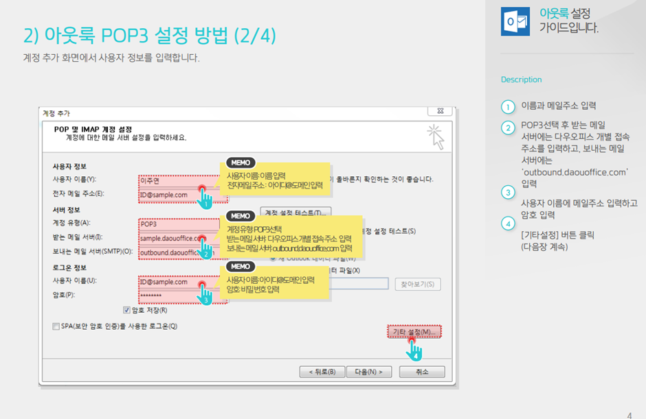
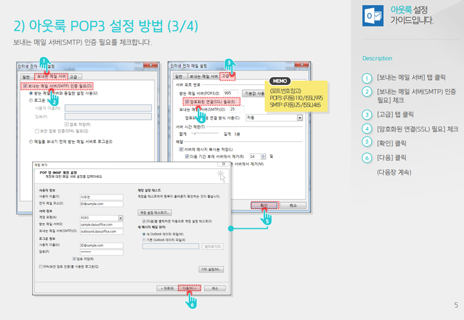

# Overview 

---
방화벽 설정 및 POP3, Gitlab 이슈를 적었다. 

gitlab의 smtp 설정에서 등록할 메일 서버가 없어서 사용자를 추가해도 인증 메일이 전송되지 않았다. 

그래서 daouoffice로 대신 연동해 보기로 했다.
POP3와 IMAP을 지원한다. 



### POP3
받는 메일이라고 불리는 POP 서버 이메일을 받아오는 표준 프로토콜이다. 
IMAP과 둘 다 이메일 수신 프로토콜이다. 

### IPTABLES
리눅스에서 방화벽 설정할 때는 iptables를 사용한다. 
커널상에서 netfilter 패킷필터링 기능을 사용자 서 제어 가능해짐.

### 패킷필터링
패킷필터링이란 패킷의 헤더로 전체 패킷의 운명을 결정하는 것. (패킷 = 헤더 + 데이터)

### 우분투 방화벽 설치 
ufw를 설치해서 진행한다. rule을 정할 수 있다. 
```bash 
# 설치 
sudo apt-get install ufw 

# 활성화 
sudo ufw enable 

# 비활성화 
sudo ufw disable

# 상태 확인 
sudo ufw status verbose 

# 들어오는 통신 차단
sudo ufw default deny incoming

# 특정 포트 허용
sudo ufw allow 443/udp
sudo ufw allow 443/tcp
sudo ufw allow https
```