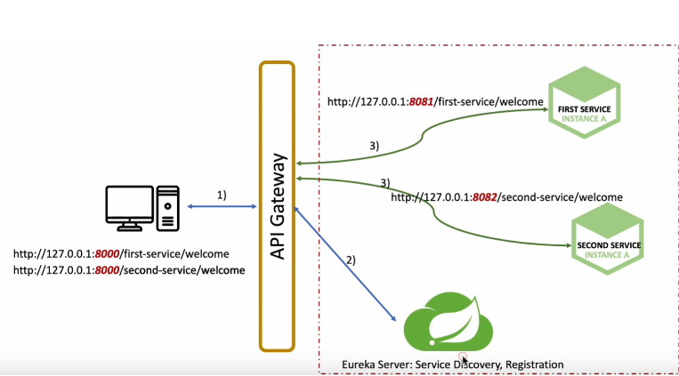
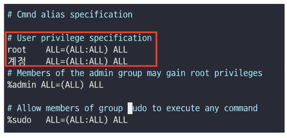

### Service Registry 

Spring Cloud Netflix가 대표적인 예시로, 각각 마이크로 서비스들의 위치를 등록하는 곳이다.

### API Gateway

클라이언트의 요청을 받으면 사전에 설정한 라우팅 설정에 따라서 각각의 endpoint로 요청을 보내고 응답을 클라이언트에게 전달하는 프록시(중간자)
다.


### SUDO 권한 

root가 아닌 일반 사용자가 관리 기능을 가능케 하는 것.
1. `/etc/sudoers` 구성 파일에 나열된 사용자여야 한다. 
2. 명령은 `root` 쉘이 아닌 사용자의 쉘에서 실행된다. 

```agsl
visudo -f /etc/sudoers // sudoers 파일 편집
```

위와 같이 계정이름을 정해서 유저를 추가하고 권한을 ALL로 설정

#### Reference 
https://minimin2.tistory.com/141

### 보일러 플레이트(Boiler Plate)

별 수정 업이 반복적으로 사용되는 코드

### Spring Boot Jar vs. War 

공통점 : 둘다 Java의 jar 옵션을 사용해 생성된 압축(아카이브) 파일이다. 
애플리케이션을 쉽게 배포하고 동작하기 위한 관련 파일(리소스, 속성 파일 등)을 패키징한 것이다.


### 3차 도메인 

맨 뒤부터 .을 기준으로 1차, 2차, 3차 도메인이라고 불린다. 
naver.com  => com(1차), naver(2차) 

현재 지양되고 있는 도메인. 
3차 도메인을 지정할 경우 추후에 A에서 B 시스템으로 이동할 때 도메인 합치기가 어려울 수 있어서 지양하자는 이야기가 나옴. 
