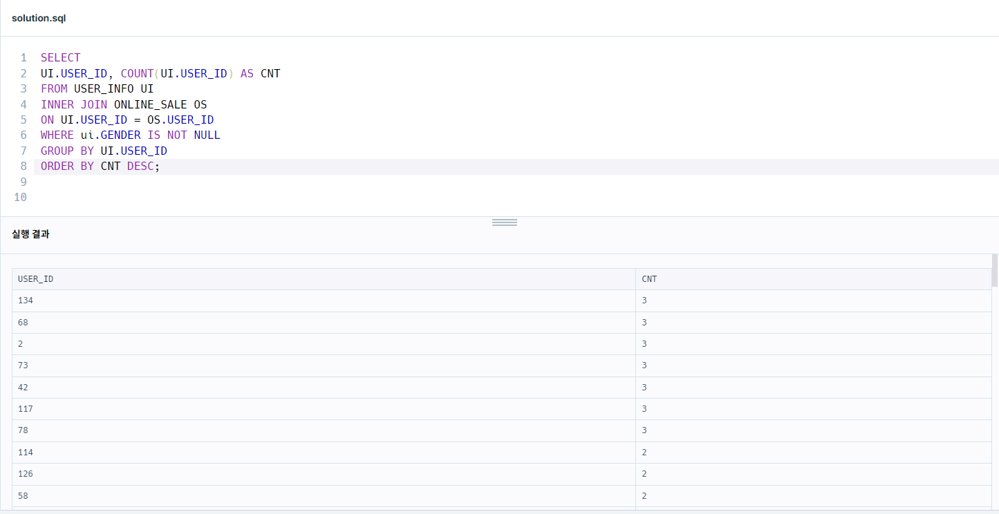

# SQL Programmers > GROUP BY 

#### 자동차 대여 기록에서 대여중 /  대여 가능 여부 구분하기

```sql 
-- 코드를 입력하세요
# SELECT CAR_ID
# , START_DATE
# , END_DATE
# # # , IF ((START_DATE = '2022-10-16' AND END_DATE >= '2022-10-16'), '대여중', '대여 가능') AS AVAILABILITY 
# , IF ((MIN(START_DATE) <= '2022-10-16' AND MAX(END_DATE) >= '2022-10-16'), '대여가능', '대여중') AS AVAILABILITY 
# FROM CAR_RENTAL_COMPANY_RENTAL_HISTORY
# GROUP BY CAR_ID
# ORDER BY CAR_ID DESC;

SELECT 
CAR_ID
# , START_DATE
# , END_DATE
, IF (START_DATE = '2022-10-16' OR END_DATE >= '2022-10-16', '대여중', '대여 가능') AS AVAILABILITY 
FROM CAR_RENTAL_COMPANY_RENTAL_HISTORY
GROUP BY CAR_ID
HAVING MAX(HISTORY_ID)
ORDER BY CAR_ID DESC;

```

* 가장 최근 history로 뒤져야 한다고 생각해서 having 조건을 걸었다. 
* 범위 계산을 틀렸다. 
* GROUP BY별로 START_DATE는 최소 날짜, END_DATE는 최대날짜를 잡아야 한다고 생각했다. 
대여 날짜가 여러 건일 텐데, GROUP BY로 했을 때 그룹별로 뜨는 1건이 무슨 기준일까 생각했다. 잘 모르겠다.
* IF() 함수에 GROUP BY가 누락된 걸지도?

```SQL 
WHERE START_DATE <= "2022-10-16" AND END_DATE >= "2022-10-16"
```
* 범위 계산을 잘못 생각했다. 
10/16일날 대여중이려면, 대여 시작날짜는 10/16일 이전이거나 10/16이어야 하고, 
대여 완료날짜는 10/16일이거나 그 이후여야 한다. 
* 최대날짜인지 여부는 안 중요하다. 해당 조건에 해당하기만 하면 되는 거다. 


정답 
```SQL
SELECT 
CAR_ID
, CASE WHEN CAR_ID IN (
    SELECT CAR_ID
    FROM CAR_RENTAL_COMPANY_RENTAL_HISTORY
    WHERE START_DATE <= '2022-10-16' AND END_DATE >= '2022-10-16'
) THEN '대여중'
ELSE '대여 가능'
END AVAILABILITY
FROM CAR_RENTAL_COMPANY_RENTAL_HISTORY
GROUP BY CAR_ID
ORDER BY CAR_ID DESC;
```
IN 절 안에도 GROUP BY가 들어갈 필요는 없었다. 

#### 대여 횟수가 많은 자동차들의 월별 대여 횟수 구하기

서브쿼리 안에도 날짜 범위 조건을 주고 메인 쿼리에서도 주어야 한다. 
그렇지 않으면 메인 쿼리에서 서브 쿼리 범위 이외의 날짜 범위가 있으면 그 결과를 포함하기 때문이다.

```SQL 
SELECT 
MONTH(START_DATE) AS MONTH
, CAR_ID
, COUNT(CAR_ID) AS RECORDS
FROM CAR_RENTAL_COMPANY_RENTAL_HISTORY
WHERE CAR_ID IN (
SELECT CAR_ID FROM CAR_RENTAL_COMPANY_RENTAL_HISTORY
WHERE START_DATE BETWEEN '2022-08-01' AND '2022-10-31'
GROUP BY CAR_ID 
HAVING COUNT(*) >= 5
)
AND START_DATE BETWEEN '2022-08-01' AND '2022-10-31'
GROUP BY MONTH, CAR_ID
ORDER BY MONTH , CAR_ID DESC;
```

#### 식품분류별 가장 비싼 식품의 정보 조회하기 

```SQL 
SELECT CATEGORY
     , PRICE AS MAX_PRICE
     , PRODUCT_NAME
FROM FOOD_PRODUCT
WHERE PRICE IN (
    SELECT MAX(PRICE) AS MAX_PRICE
    FROM FOOD_PRODUCT
    GROUP BY CATEGORY
    HAVING MAX(PRICE)
)
  AND CATEGORY IN ('과자', '국', '김치', '식용유')
ORDER BY MAX_PRICE DESC;
```
드디어 하나 정답... 
1. 식품별로 가장 비싼 가격을 구한다. 
2. 1을 서브쿼리로 만들고 IN()으로 감싸서 해당 가격을 가지는 상품들을 출력한다. 
3. 카테고리를 4개로 한정한다(문제의 조건)
4. ORDER BY로 주어진 조건대로 정렬한다.

#### 동명 동물 수 찾기 
```SQL 
SELECT NAME, COUNT(NAME) AS COUNT
FROM ANIMAL_INS
GROUP BY NAME
HAVING COUNT(NAME) >= 2
ORDER BY NAME;
```
* 이름이 없는 동물은 집계하지 않는 조건은 IS NOT NULL로 처음에 설정했지만, 제외해도 문제가 없었다.
* COUNT(*)로 하면 NULL값도 포함해서 컬럼명으로 적었지만, 2번 이상 사용되었다는 필터에서 탈락이므로 상관없었을 듯 하다.

#### 년,월, 성별 별 상품 구매 회원 수 구하기

```SQL 
SELECT 
YEAR(SALES_DATE) AS YEAR
, MONTH(SALES_DATE) AS MONTH
, GENDER
, COUNT(DISTINCT UI.USER_ID) AS USERS 
FROM USER_INFO UI
INNER JOIN ONLINE_SALE OS
ON UI.USER_ID = OS.USER_ID
WHERE ui.GENDER IS NOT NULL
GROUP BY YEAR, MONTH, GENDER
ORDER BY YEAR, MONTH, GENDER;
```
* USER_ID에 중복 제거를 하지 않아서 오답 발생했음. 
왜냐하면 한 회원이 여러 상품을 구매했을 경우도 있기 때문에 이를 고려해야 했다.

