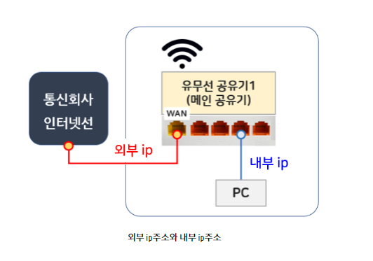
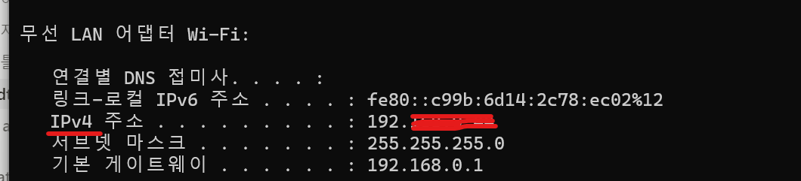

# IP

---

## 외부 IP와 내부 IP
IP는 네트워크 상의 기기들에게 할당된 고유 주소이다. 

`외부 IP` : 통신사에서 들어오는 외부 인터넷 회선 할당 IP주소

`내부 IP` : 외부 IP주소를 받아서 공유기에 연결된 기기에 할당되는 IP 주소

외부 IP 주소 특징 
* 개인이 설정, 변경할 수 없다. 
* 외부로 공개되어 있어 NAVER에 IP 주소라고 치면 확인 가능하다. 

내부 IP 주소 특징 
* 공유기를 사용할 때 내부 네트워크에서 가상으로 부여받는 IP 주소다.

윈도우에서 cmd창을 열고 ipconfig라고 입력하면 IPV4주소가 나온다. 
IPV6가 더 기능/성능적으로 뛰어나지만 호환성 등의 문제로 한국은 아직 IPV4가 많이 쓰이는 상황이다. 

###  Reference
https://barrogo.tistory.com/115

## 고정 IP와 유동 IP
`고정 IP 주소` : 장비(컴퓨터)에 고정적으로 부여된 IP. IP를 반납하기 전까지는 다른 장비에 부여할 수 없다. 
컴퓨터를 껐다 켜도 변하지 않는다. 

`유동 IP 주소` : 컴퓨터를 사용할 때 남아 있는 IP 중에서 돌아가면서 부여하는 IP
같은 장소에서 인터넷에 접속하더라도 그때그때 IP 주소가 변동될 수 있다. 

IP 주소가 부족해지는 문제가 발생하자, DHCP 서버를 사용해서 필요할 때마다 임시 IP 주소를 부여하는 유동 IP 주소 공급을 시작했다. 

`DHCP` : 넷웍 관리자 또는 장치가 네트워크 내의 IP주소를 동적 할당하는 프로토콜이다. 
RFC 2131에서 표준 규약을 정의하고 있다. 

## 포트 포워딩(Port Forwarding)
포트 포워딩은 특정한 포트로 들어오는 `데이터 패킷`을 다른 포트로 바꿔서 재전송해주는 작업이다. 
수신 데이터가 NAT 방화벽을 우회하도록 하여 인터넷 연결 속도를 개선한다.

즉, 특정한 방식으로 라우터를 설정하여 데이터를 이동시키는 방법이라고 할 수 있다. 

포트 포워딩을 쓰면 속도가 빨라지는 이유는, 서버 포트 포워딩을 설정하면 라우터에 일부 데이터를 네트워크 내의 특정 기기로 전송하라고 명령하기 때문이다.

#### 어떨 때 유용한가? 
가정용 네트워크와 원격 기기 사이를 직접 연결하는 경우에 유용하다. 

#### 어떻게 설정하는가?
라우터에 들어가서 포트를 설정하고, 넷웍에서 포트를 연결하고자 하는 기기의 로컬 IP 주소를 입력한다. 
결과적으로, 사설 IP 주소를 노출하지 않으면서 특정 포트로 전송되는 모든 요청을 바로 기기로 리다이렉션할 수 있다. 
