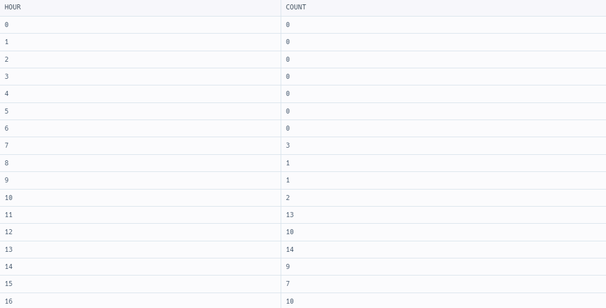

# SQL Programmers > JOIN

---
### 그룹별 조건에 맞는 식당 목록 출력하기
꽤나 고전했던 문제. MAX(COUNT(컬럼명))은 불가능하다. 
COUNT한 서브쿼리로부터 MAX()를 뽑아내야만 한다. 
```sql
SELECT MP.MEMBER_NAME
, RV.REVIEW_TEXT
,  DATE_FORMAT(RV.REVIEW_DATE, '%Y-%m-%d') AS REVIEW_DATE
FROM REST_REVIEW RV
INNER JOIN MEMBER_PROFILE MP
ON RV.MEMBER_ID = MP.MEMBER_ID
WHERE MP.MEMBER_ID IN (
    SELECT MEMBER_ID FROM REST_REVIEW  
    GROUP BY MEMBER_ID
    HAVING COUNT(MEMBER_ID) = (
        SELECT MAX(RV_CNT) FROM 
        (SELECT COUNT(MEMBER_ID)AS RV_CNT FROM REST_REVIEW GROUP BY MEMBER_ID) T
    )
)
ORDER BY RV.REVIEW_DATE, RV.REVIEW_TEXT;
```

가장 많이 리뷰를 작성한 '사람'의 모든 리뷰 리스트를 가져오는 것이었기 때문에 
많이 작성한 사람의 리뷰 한 건만 각각 가져오는 그룹핑을 잘못해서 오답을 많이 냈었다. 


시간이 시분초까지 나오는 데이터에서 년월일만 출력할 때는 DATE_FORMAT() 함수를 사용한다. 
```SQL
,  DATE_FORMAT(RV.REVIEW_DATE, '%Y-%m-%d') AS REVIEW_DATE
```

또한 식당에서 리뷰를 작성했지만, 회원이 아닌 사람이 작성한 경우도 있다. 
따라서 INNER JOIN을 해야 한다. (현 시점 회원 아닌 사람 리뷰 1건이 있었다)

### DATE_FORMAT()의 대소문자 차이
앞서 말했던 DATE_FORMAT() 함수는 형식이 대문자면 4자리, 소문자면 2자리를 출력한다. 
```sql
DATE_FORMAT(SALES_DATE, '%Y-%m-%d')
# '2022-03-01'
    
DATE_FORMAT(SALES_DATE, '%y-%m-%d')
# '22-03-01'
```

### 상품을 구매한 회원 비율 구하기 

```sql
SELECT YEAR(OS.SALES_DATE) AS YEAR
, MONTH(OS.SALES_DATE) AS MONTH
, COUNT(DISTINCT OS.USER_ID) AS PUCHASED_USERS 
, ROUND(COUNT(DISTINCT OS.USER_ID) / (SELECT COUNT(USER_ID) FROM USER_INFO WHERE YEAR(JOINED) = '2021'), 1) AS PUCHASED_RATIO 
FROM ONLINE_SALE OS 
WHERE OS.USER_ID IN (
    SELECT USER_ID FROM USER_INFO WHERE YEAR(JOINED) = '2021'
) AND YEAR(OS.SALES_DATE) = '2022'
GROUP BY YEAR, MONTH
ORDER BY YEAR, MONTH;
```
* DISTINCT, 중복 경우를 고려하지 않아서 오답이었다. 
* ONLINE_SALE의 경우 한 사람이 구매를 N번 할 수 있는데, 여기서는 구매 횟수 관계없이 주문 한 회원의 수를 따지기 때문에 중복을 제거해야 한다. 

TIL) 상품, 구매 관련해서는 어떤 때 중복을 고려해야 하는지/아닌지 여부를 생각해봐야 한다.

# SQL Programmers > Group By

### 입양 시각 구하기(2)
입양된 동물이 없는 시각의 경우에도 시각을 리스트로 출력해야 하는 부분이 어려웠다. 
UNION ALL로  0부터 23까지 한줄한줄 더할 수는 없으니, WITH RECURSIVE 구문과 서브쿼리를 사용해서 출력했다. 

```SQL 
WITH RECURSIVE cte AS (
    SELECT 0 as HOUR
    UNION ALL
    SELECT HOUR + 1 FROM cte WHERE HOUR < 23
)
SELECT HOUR, (
    SELECT COUNT(*)
    FROM ANIMAL_OUTS
    WHERE HOUR = HOUR(DATETIME)
      # GROUP BY HOUR(DATETIME) 
) AS COUNT FROM cte

```

아래 GROUP BY절 때문에 COUNT(*)가 공집합이 뜬다. 제거하면 0으로 출력된다. 
```SQL
# GROUP BY HOUR(DATETIME)
```


GROUP BY를 좀 더 알고 써야 한다고 느낀다. 

### 가격대 별 상품 개수 구하기
처음에는 가격대별로 MIN, MAX를 구해서 그걸 서브쿼리로부터 꺼내서 
BETWEEN 조건절에 MIN, MAX를 넣을 생각이었는데, 실패했다. 

MYSQL 정답 
```sql
SELECT FLOOR(price / 10000) * 10000 AS PRICE_GROUP, COUNT(*) AS PRODUCTS 
FROM PRODUCT
GROUP BY FLOOR(price / 10000)
ORDER BY FLOOR(price / 10000);
```
내가 원하는 가격 범위대가 5000이라면 10000자리에 5000을 넣으면 된다. 
즉 아래와 같다. 
```sql
FLOOR(상품의 가격 컬럼명 / 분류하고 싶은 가격대 금액) * 분류하고 싶은 가격대 금액
```
가격을 분류대 금액으로 나누고 FLOOR()로 소숫점 뒤는 다 버린다. 
이후에 다시 분류대 금액을 곱한 금액을 곱하면 된다. 수학 공식처럼 외우는 수밖에 없다.

# SQL Programmers > String, Date

조건에 부합하는 중고거래 상태 조회, case문을 괄호로 감싸면 syntax error가 발생한다. 
```sql 
SELECT BOARD_ID, WRITER_ID, TITLE, PRICE
, CASE  
   WHEN STATUS = 'DONE' THEN '거래완료' 
   WHEN STATUS = 'RESERVED' THEN '예약중' 
   WHEN STATUS = 'SALE' THEN '판매중' 
   END AS STATUS
FROM USED_GOODS_BOARD 
WHERE CREATED_DATE = '2022-10-05'
ORDER BY BOARD_ID DESC;
```
