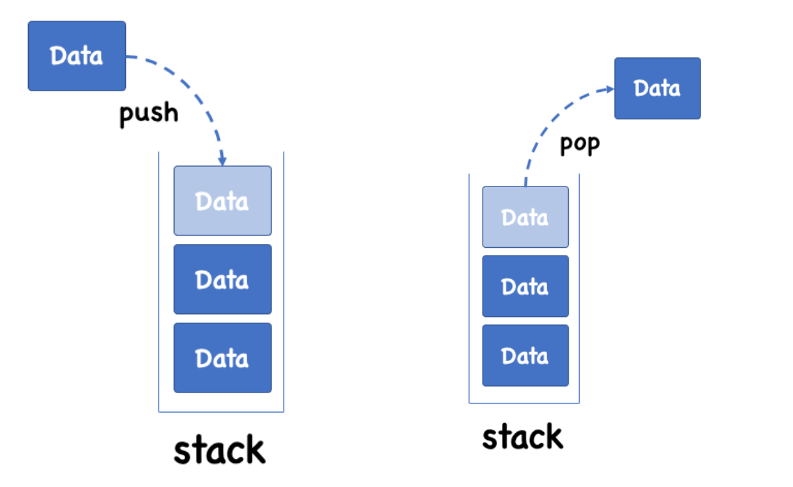
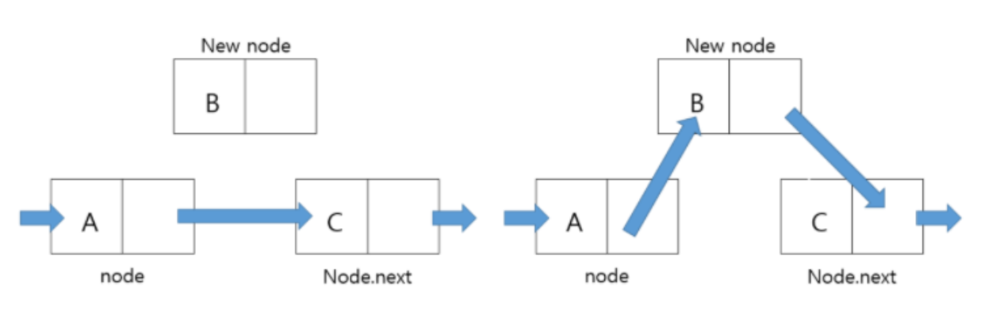

# Algorithum

---

## Stack(스택)이란
LIFO(후입선출) 방식을 가진 자료구조이며, 
스택에서 최상단에 있는 데이터를 TOP이라고 한다. 



### 자바의 Stack 사용하기
자바에는 기본적으로 Stack 타입이 존재한다. 아래와 같이 사용가능하다. 
```java 
public class Test {
    public static void main(String[] args) {
        Stack<Integer> stack = new Stack<Integer>();
        stack.push(1); // 값 추가
        stack.peek(); // 스택에서 다음 항목 열람
        stack.empty(); // 스택 비우기
    }
}
```

### 커스텀 Stack 만들어 사용하기 
자료구조 및 알고리즘 공부용으로 Stack을 자체적으로 만드는 문제들에서 만든 커스텀 Stack이 있다. 
배열 또는 LinkedList로 구현한다. 

### 배열로 구현하기 
Object 배열을 생성해서 crud 메서드들을 만든다. 
```java 
class ArrayStack{
	private String type;
    private int capacity;
    private int top = -1;
    private Object stackArray[];
    
    ArrayStack(String type){
    	this.type = type;
        this.capacity = 100;
        stackArray = new Object[capacity];
    }
    ArrayStack(String type, int capacity){
    	this.type = type;
        this.capacity = capacity;
        stackArray = new Object[capacity];
    }
    
    public void push(Object element){}
    
    public Object pop(){}
    
    public boolean isEmpty(){}
    
    public boolean isFull(){}
    
    public Object peek(){}
    
    public void clear(){}
    
    public void printStack(){}
    
    public int size(){}
}
```

#### Reference
https://velog.io/@yeonwoo1125/Java-배열로-Stack-구현하기


### LinkedList로 구현하기

링크드리스트로 스택을 구현하기 위해서는 별도의 Node 클래스를 직접 구현해야 한다.

Node들은 값을 보관하는 틀일 뿐이고, 직접적으로 push, pop 등의 crud를 수행하는 것은 NodeManager임을 알 수 있다. 

```java 

```