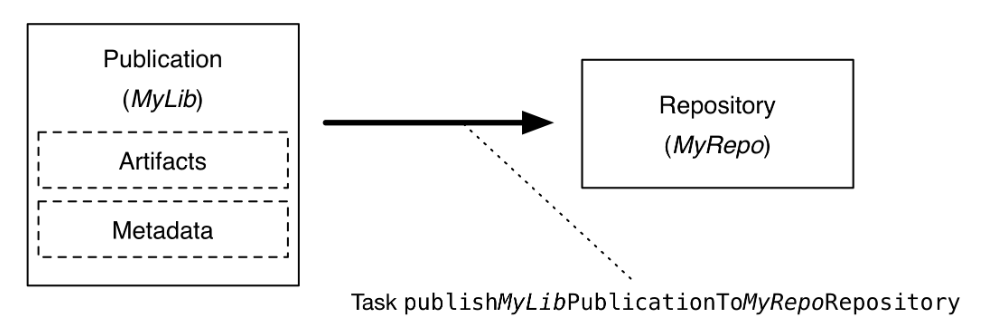

# AIDT_오늘의 TIL

--- 

## 빌드와 배포 프로세스 
프로젝트 gradle > build후 gradle > publish하면 등록된 Nexus로 자동 배포된다고 한다. (이쪽 환경이 그럼)
완성된 것을 Nexus에서 당겨오기만 하면 되니까? ap단만 ci/cd를 한다. 

신기한 점은 젠킨스에서 설정을 다 해놓아서 한번에 Nexus부터 WAS/deploy까지 해결이 가능하다는 건데. 

## Release와 Snapshot의 차이 
### snapshot
말 그대로 스냅샷처럼 application을 특정 시간, 버전으로 하나 따 놓는 것이다. 
데이터도 특정 시점의 상태를 백업하기 위해서 스냅샷을 뜨기도 한다.

*간혹 가다가 다 뜯어고친 app을 옛날로~ 원상복구해야 할 경우가 있다고 한다. (또는 급하게 땜빵을 치기 위해서 사용)

### Release 
version에 스냅샷이 없으면 다 릴리스로 들어간다고 생각하면 됨. 이걸 devOps?에서 잡아준다고 한다. 


gradle.properties에 등록된 정보들을 이용해서 

## Publish를 Gradle에서 어케 한다고? 
사실 publish라는 게 뭐냐고? 부터 시작했다. 

### Publishing 
아파치 메이븐 레퍼지토리에 build artifacts를 발행(publish)하는 것을 말한다. <br />
아래를 보아하니 아티팩츠와 메타데이터를 Nexus 같은 곳에 올리는 행위를 말하는 거네. 

```properties
/* maven repository로 publish하기 위해서 build.gradle에서 id 'maven-publish'를 한다.*/ 

publishing { 
	publications {

	}

	repositories {
		maven {
			// name, credentials 지정
			credentials {
				username nexusUsername
				password nexusPassword
			}
		}
	}
}
```