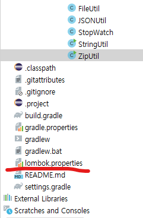

# AIDT_오늘의 TIL

--- 

## Lombok의 @AllArgsConstructor를 막아버리자. 
@AllArgsConstructor는 위험성이 있으니 사용하지 말라는 상사 지시가 있었다.<br />
특정 어노테이션에 대한 usage 설정을 막아볼까? lombok.properties에 설정하면 된다. 

lombok.properties
```properties
lombok.AllArgsConstructor.flagUsage = error
lombok.RequiredArgsConstructor.flagUsage = error
lombok.Data.flagUsage= error
lombok.Value.flagUsage= error
lombok.Log.flagUsage= error
lombok.EqualsAndHashCode.flagUsage = error
lombok.ToString.flagUsage = error
```


### 프로젝트 내 위치
 <br />
최상단에 위치했다.

### 왜 @AllArgsConstructor를 쓰면 안되는 걸까?
대략 두 가지 이유가 있다. <br />

첫째는 순환 참조 이슈이다. 특정 객체가 다른 객체의 필드로 들어가고 같이 엮여서 빈 등록되어 올라갈 때 오류가 생기기도 한다. 
<br />

둘째는 @AllArgs~ 를 사용할 경우 필드(iv) 수만큼을 매개변수로 가지는 생성자가 생기는데, 이것이 생성된 후에 필드 순서가 변경되었을 경우, 
다른 쪽에서 이 객체를 참조했을 때 필드 오류가 생기기 때문이다. 

위와 같은 이유로 @Builder 를 사용하도록 하자. 


### 참고 
아래서도 우리처럼 특정 Usage를 error로 처리하고 log 생성 객체 이름도 바꿨다. 
https://akageun.github.io/2019/07/02/lombok-config.html